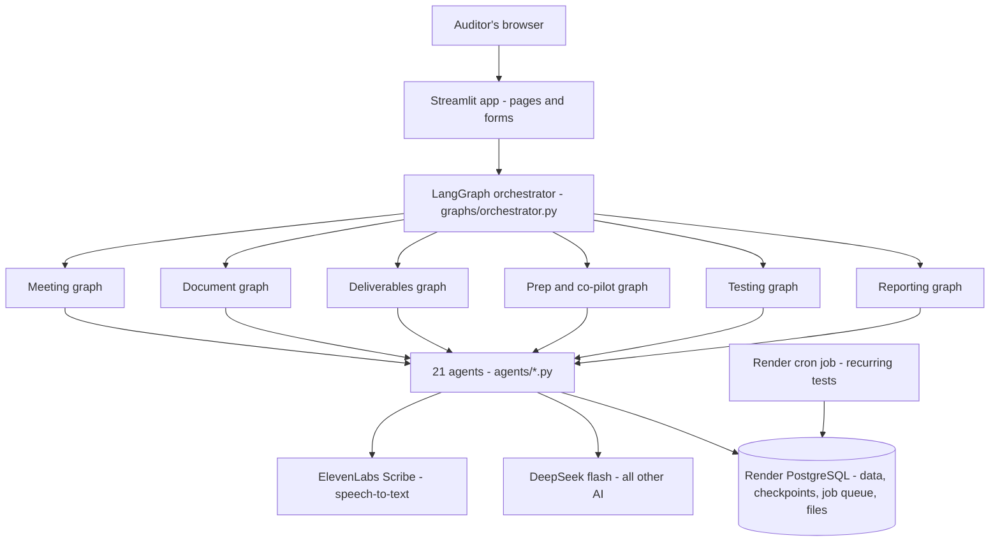
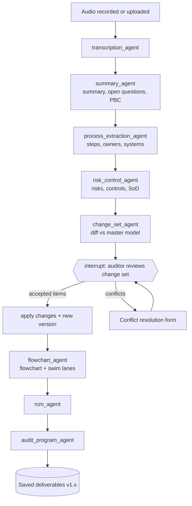

# 1. Document control

| Item | Detail |
| --- | --- |
| Product | FieldAI – AI Audit Fieldwork Assistant |
| Document | Product Requirements Document (PRD), derived from *BRD – AI Audit Fieldwork Assistant* v0.1 |
| Version | 0.2 – Draft for approval. v0.2 moves hosting from Streamlit Community Cloud + Supabase to Render (web service, background worker, cron job and PostgreSQL) |
| Prepared by | Sami Associates |
| Approver | Product owner (Sami) |
| Status | Awaiting review. Code is built only after this PRD is approved. |

**Decisions taken for this PRD**

| # | Decision | Source |
| --- | --- | --- |
| D1 | Orchestration with **LangGraph** (Python), one agent per Python file | User |
| D2 | **PostgreSQL** hosted on **Render PostgreSQL** (data, LangGraph checkpoints, job queue and uploaded files) | User |
| D3 | Code in a **GitHub** repository; deployed on **Render** with one Blueprint file (`render.yaml`): a Streamlit **web service**, a **background worker** for long AI jobs and a **cron job** for recurring tests. UI framework stays **Streamlit** | User |
| D4 | Speech-to-text: **ElevenLabs Scribe** (primary) with **OpenAI gpt-4o-transcribe** as optional fallback; provider switchable in settings | Claude's choice (user delegated) – chosen for Arabic + English accuracy, built-in speaker labels (diarization) and word timestamps |
| D5 | All other AI features use **DeepSeek "flash"** through DeepSeek's OpenAI-compatible API. The exact model ID is a setting (`DEEPSEEK_MODEL`); default `deepseek-v4-flash`, **to be confirmed against DeepSeek's model list before go-live** | User |
| D6 | Data-residency / PDPL / NCA hosting requirements from the BRD are **out of scope** for this version | User |
| D7 | Scope = **all BRD modules 1–7 plus all Phase 2 and Phase 3 roadmap options** | User |

# 2. Product overview

FieldAI turns audit walkthrough meetings and auditee documents into a complete, linked set of audit work papers:

1. **Capture** – record a walkthrough in the browser or upload audio/video; transcribe with speakers and timestamps.
2. **Process table** – each step with owner, system, risk (R-xx) and control (C-xx).
3. **Flowchart** – risks and controls marked on the steps by ID.
4. **Swim lanes** – the same flow laid out by role, department or system.
5. **Audit program** – test steps, sample sizes and evidence per control, built from the risk-control matrix (RCM).
6. **Follow-up meetings** – each new meeting updates one master process model through a reviewed change set.
7. **Auditee documents** – SOPs, manuals and policies are reconciled against what was said.
8. **Phase 2–3 features** – pre-meeting question packs, near-live interview co-pilot, analytics, SoD, process mining, evidence reading, draft findings, QA review, dashboard and continuous monitoring.

Every AI output is a **draft** that the auditor reviews and approves. Approved items are versioned and traceable to their source (meeting timestamp or document page).

## 2.1 Goals

| ID | Goal | Measure |
| --- | --- | --- |
| G1 | Cut walkthrough documentation time | ≥ 50% less time from meeting end to approved RCM and program (pilot) |
| G2 | One consistent set of work papers per process | All deliverables generated from one master model; 0 manual re-keying |
| G3 | Full traceability | 100% of tests linked to Control ID, Risk ID and Step ID; every item links to a source |
| G4 | Beginner-operable | App deployed by a non-developer using the step-by-step guide shipped with the code |

## 2.2 Non-goals (this version)

- Saudi data residency, PDPL, NCA ECC hosting controls (decision D6).
- Native Microsoft Teams / Zoom bot that joins meetings (audio is recorded in the browser or uploaded instead).
- Native `.vsdx` (Visio) file writing – replaced by draw.io and BPMN exports, which Visio users can convert (see §9).
- Executing arbitrary AI-written code against client data (analytics use a fixed, tested test library – see §6.15).
- Direct live connections to client ERPs (data is uploaded as CSV/Excel extracts).

# 3. Users and roles

| Role | Can do |
| --- | --- |
| **Auditor** | Create processes, record/upload meetings and documents, review change sets, edit drafts, run tests |
| **Manager** | Everything an auditor can, plus approve RCM / audit program / findings and lock versions |
| **Admin** | Manage users, risk & control libraries, sampling table, framework catalogue, AI settings |
| **Auditee (read-only link)** | View a shared process flow and confirm or comment (Phase 2 confirmation portal) |

Authentication: username + password (bcrypt-hashed) stored in Postgres. The first admin is created from environment variables on first run.

# 4. System architecture



| Layer | Technology | Notes |
| --- | --- | --- |
| UI | Streamlit (multipage), `st.audio_input`, `st.data_editor`, `st.graphviz_chart` | Render **web service** (Docker), auto-deployed from the GitHub repo on every commit |
| Job runner | `worker.py` – Render **background worker** (Docker, same image) | Runs LangGraph graphs for long jobs so the web page stays responsive |
| Orchestration | LangGraph `StateGraph`, `interrupt()` for human review, `PostgresSaver` checkpointer | Graph state survives app restarts because checkpoints live in Postgres |
| Agents | One Python module per agent in `agents/` | Each exposes `run(state) -> dict` used as a LangGraph node |
| LLM | DeepSeek via `openai` Python SDK (`base_url=https://api.deepseek.com`), JSON output mode | Responses validated with Pydantic; one automatic retry on invalid JSON |
| Speech-to-text | ElevenLabs Scribe (`elevenlabs` SDK); fallback OpenAI `gpt-4o-transcribe` | Returns words, timestamps, speaker IDs, detected language |
| Database | Render PostgreSQL via `psycopg` 3 (internal connection URL injected by the Blueprint) | Schema in `db/schema.sql` and seed data in `db/seed.sql`, applied automatically on start |
| Files | `files` table in PostgreSQL (binary column) behind `core/storage.py` | Audio is compressed to Opus/MP3 with ffmpeg before saving. Render disks attach to one service only, so the database is the one store both web and worker can read. `storage.py` can later point to S3-compatible storage with a setting |
| Diagrams | Graphviz DOT (`graphviz` Python package + Graphviz installed in the Docker image) | Rendered in-app; exported as SVG/PNG/PDF |
| Exports | `openpyxl`, `python-docx`, `reportlab`, custom BPMN 2.0 and draw.io XML writers | |
| OCR | `pytesseract` + Tesseract (Arabic + English), `pdfplumber`, `pdf2image` | Installed in the Docker image (`Dockerfile`) |
| Scheduled jobs | Render **cron job** running `jobs/run_monitoring.py` (e.g. weekly) | Same Docker image and database |
| Hosting definition | `render.yaml` Blueprint + `Dockerfile` | One click in Render creates database, web service, worker and cron job together |

## 4.1 Multi-agent pattern

FieldAI uses a **supervisor + sub-graph** pattern:

- The **orchestrator** receives a task from the UI (e.g. `process_meeting`, `ingest_document`, `build_program`, `run_test`, `ask`) and routes it to the matching sub-graph. UI-triggered tasks are routed deterministically (no LLM cost). Free-text questions in the *Ask FieldAI* box are routed by a small DeepSeek classification call.
- Each **sub-graph** chains agents as nodes. Shared data passes through a typed `FieldAIState`.
- **Human-in-the-loop:** graphs pause with LangGraph `interrupt()` where the auditor must decide (change-set review, conflict resolution, reconciliation review). The UI shows the pending decision; on submit the graph resumes with `Command(resume=...)`.
- **Persistence:** the Postgres checkpointer stores every graph run by `thread_id = <process_id>:<run_id>`, so a paused review can be resumed later, even after a restart or redeploy.
- **Job queue:** pressing a button that starts long work (transcription, document OCR, analytics) writes a row to the `jobs` table. The background worker picks it up (`SELECT … FOR UPDATE SKIP LOCKED`, no Redis needed), runs the graph and writes progress back. The page polls the job status and shows a progress bar. Short actions (editing a row, redrawing a flowchart) run directly in the web service.

## 4.2 Meeting graph (core flow)



## 4.3 Graph catalogue

| Graph file | Trigger | Nodes (agents) in order | Interrupts |
| --- | --- | --- | --- |
| `graphs/meeting_graph.py` | New meeting audio | transcription → summary → process_extraction → risk_control → change_set → *review* → apply → flowchart → rcm → audit_program | Change-set review; conflict resolution |
| `graphs/document_graph.py` | Document upload | document → reconciliation → *review* → apply → flowchart → rcm → audit_program | Reconciliation review |
| `graphs/deliverables_graph.py` | "Rebuild deliverables" or table edit | flowchart → rcm → audit_program → knowledge (YoY change detection) | Manager approval (optional) |
| `graphs/prep_graph.py` | "Prepare next meeting" / live co-pilot chunk | prep (question pack, scoping) · copilot (per audio chunk) | – |
| `graphs/testing_graph.py` | "Run test" on a control | router → analytics / sod / process_mining / evidence → monitoring (save as recurring) | Exception follow-up |
| `graphs/reporting_graph.py` | "Draft findings" / "QA check" | findings → qa_review | Manager approval |
| `graphs/orchestrator.py` | Every UI action + *Ask FieldAI* | router → one of the graphs above, or doc_qa | – |

# 5. Shared state and data contracts

## 5.1 LangGraph state (`graphs/state.py`)

```python
class FieldAIState(TypedDict, total=False):
    task: str                    # e.g. "process_meeting"
    engagement_id: int
    process_id: int
    source_id: int               # meeting or document being processed
    user_id: int
    language: str                # "ar", "en", "mixed"
    transcript: list[dict]       # [{speaker, start, end, text}]
    summary: dict                # summary, open_questions, pbc_requests
    extracted_steps: list[dict]  # ProcessStep objects
    extracted_risks: list[dict]
    extracted_controls: list[dict]
    change_set: list[dict]       # ChangeItem objects
    review_decisions: dict       # from the interrupt
    document_extract: dict
    reconciliation: list[dict]
    deliverables: dict           # dot, rcm rows, program rows, file paths
    test_request: dict
    test_result: dict
    findings: list[dict]
    messages: list               # for Ask FieldAI / co-pilot
    errors: list[str]
```

## 5.2 Core Pydantic schemas (`core/schemas.py`)

| Schema | Key fields |
| --- | --- |
| `ProcessStep` | step_code (P2P-01), order, description, responsible_role, responsible_person, department, system, inputs, outputs, frequency, documents, is_decision, sources[], confidence |
| `Risk` | risk_code (R-01), description, step_codes[], inherent_rating (High/Medium/Low), ai_suggested, library_ref, sources[], confidence |
| `Control` | control_code (C-01), description, step_codes[], risk_codes[], type (preventive/detective), nature (manual/automated/IT-dependent), frequency, owner, key_control, design_rating, framework_refs[], criteria_ref, ai_suggested, sources[] |
| `SourceRef` | source_id, kind (meeting/document), locator ("00:04:12" or "SOP v3 §3.2 p.4") |
| `ChangeItem` | entity (step/risk/control/link), action (Added/Changed/Confirmed/Contradicted/Removed), target_code, before, after, evidence[], conflict_with |
| `ReconItem` | category (Matches / Documented-not-described / Described-not-documented / Conflicting detail / Outdated document), item_code, doc_ref, meeting_ref, note, suggested_action |
| `TestStep` | test_code (T-01), control_code, objective, test_type (ToD/ToE/analytics), procedure, sample_size, sample_basis, evidence_pbc[], attributes[], performer, reviewer, wp_ref, result, exception |
| `Finding` | finding_code, condition, criteria, cause, effect, recommendation, rating, linked tests/controls |

## 5.3 Database (PostgreSQL – `db/schema.sql`)

| Table | Purpose |
| --- | --- |
| `users` | username, password_hash, role, active |
| `engagements` | name, entity, period, status |
| `processes` | engagement_id, name, code_prefix (e.g. P2P), current_version |
| `sources` | process_id, kind (meeting/document), title, storage_path, language, consent_recorded, created_by |
| `transcript_segments` | source_id, speaker_label, speaker_name, start_s, end_s, text, redacted |
| `steps`, `risks`, `controls` | master model rows with stable codes, status (active/withdrawn), confidence, ai_suggested |
| `risk_control_links` | risk_id, control_id |
| `item_sources` | entity, entity_id, source_id, locator |
| `versions` | process_id, version_label (v1.0, v1.1), snapshot JSONB, change_log, approved_by, approved_at, locked |
| `change_sets`, `change_items` | proposed changes, decision (accepted/rejected/edited), resolution_note |
| `open_items` | process_id, question, origin, status, raised_in_source, closed_in_source |
| `pbc_requests` | item, owner, due_date, status, linked_test_id, document_id |
| `documents` | source_id, doc_type, owner, version, effective_date, approval_status, received_on, outdated_flag |
| `doc_chunks` | document_id, page, section, text (for search + citations) |
| `recon_items` | process_id, category, refs, decision |
| `tests` | audit program rows (TestStep) |
| `test_runs` | test_id, run_type, parameters JSONB, result_summary, exceptions JSONB, run_at, recurring |
| `findings` | 5 Cs, rating, status, approvals |
| `review_notes` | target, note, raised_by, status |
| `risk_library`, `control_library`, `framework_controls`, `sampling_table`, `sod_rules`, `analytics_library` | admin-maintained reference data, seeded on first run |
| `audit_log` | user_id, action, entity, entity_id, details JSONB, at (append-only) |
| `files` | id, filename, mime_type, size_bytes, data (BYTEA), sha256, created_by, delete_after |
| `jobs` | id, job_type, payload JSONB, status (queued/running/waiting_review/done/failed), progress %, message, thread_id, created_by, started_at, finished_at |
| LangGraph tables | created automatically by `PostgresSaver.setup()` |

**ID rules (BRD FR-6.2):** codes are allocated by the database (next free number per process and type); they are never renumbered; dropped items get `status='withdrawn'`.

# 6. Agent specifications

Each agent lives in its own file in `agents/`, exposes `run(state: FieldAIState) -> dict` (the partial state update), uses `core/llm.py` for DeepSeek calls and validates output with the schemas in §5.2. Prompts are stored as constants at the top of each agent file so they can be tuned without touching logic.

| # | Agent file | BRD reference | Purpose | AI used |
| --- | --- | --- | --- | --- |
| 1 | `transcription_agent.py` | FR-1.1–1.9 | Speech-to-text with speakers and timestamps | ElevenLabs Scribe |
| 2 | `summary_agent.py` | FR-1.10 | Meeting summary, open questions, PBC list | DeepSeek |
| 3 | `process_extraction_agent.py` | FR-2.1–2.2, 2.6–2.9 | Ordered steps with owners, systems, inputs/outputs, decisions | DeepSeek |
| 4 | `risk_control_agent.py` | FR-2.3–2.6 | Risks, controls, attributes, SoD conflicts, library suggestions | DeepSeek |
| 5 | `change_set_agent.py` | FR-6.1–6.6, 6.9 | Diff new extraction vs master model; entity resolution; conflicts | DeepSeek |
| 6 | `document_agent.py` | FR-7.1–7.3, 7.5, 7.7 | Parse/OCR documents, register metadata, extract steps/controls with citations | DeepSeek + OCR |
| 7 | `reconciliation_agent.py` | FR-7.4 | Said vs documented gap report | DeepSeek |
| 8 | `flowchart_agent.py` | FR-3.x, 4.x | Flowchart + swim lanes (DOT), BPMN, draw.io; gap highlighting | None (deterministic) |
| 9 | `rcm_agent.py` | FR-5.1–5.2, 5.7; Options 7, 8 | Build RCM, rate design, suggest controls for gaps, map frameworks | DeepSeek |
| 10 | `audit_program_agent.py` | FR-5.3–5.8, FR-7.6 | ToD/ToE steps, sample sizes, PBC, criteria references | DeepSeek + sampling table |
| 11 | `prep_agent.py` | FR-6.7; Options 1, 2 | Pre-meeting question pack, follow-up agenda, risk-based scoping | DeepSeek |
| 12 | `copilot_agent.py` | Options 3, 4 | Near-live follow-up prompts and PBC capture from audio chunks | Scribe + DeepSeek |
| 13 | `knowledge_agent.py` | Options 9, 19 | Reuse prior approved processes; year-on-year change detection | DeepSeek |
| 14 | `doc_qa_agent.py` | FR-7.8 | Answer questions over documents/transcripts with citations | DeepSeek |
| 15 | `analytics_agent.py` | Option 11 | Map uploaded data to library tests and run them (pandas) | DeepSeek (mapping only) |
| 16 | `evidence_agent.py` | Option 12 | OCR evidence files and check test attributes | OCR + DeepSeek |
| 17 | `sod_agent.py` | Option 13 | User-access extract vs SoD rule set; link conflicts to lanes | Rules + DeepSeek (role mapping) |
| 18 | `process_mining_agent.py` | Option 10 | Event-log variants vs described flow; bypasses | pandas + DeepSeek (activity mapping) |
| 19 | `monitoring_agent.py` | Option 14 | Save tests as recurring; re-run via scheduled job; alert on exceptions | None |
| 20 | `findings_agent.py` | Option 15 | Draft 5 Cs findings from exceptions and gaps | DeepSeek |
| 21 | `qa_review_agent.py` | Option 17 | Check work papers against IIA Standards / methodology checklist | DeepSeek |

Not agents (UI or shared modules): consent capture, auditee confirmation portal (Option 16), CAE dashboard (Option 18), version compare (FR-6.8), exports.

## 6.1 transcription_agent

- **Input:** `source_id` with audio in the `files` table; language hint (auto / ar / en).
- **Process:** call ElevenLabs Scribe with diarization and word timestamps; group words into speaker segments; detect language. On provider error, retry once, then fall back to OpenAI `gpt-4o-transcribe` if a key is configured. Files above the provider limit are split with `pydub` and re-stitched with offset timestamps.
- **Output:** `transcript` segments saved to `transcript_segments`; speakers shown as *Speaker 1…n* until the auditor maps them to names/roles (FR-1.6).
- **Rules:** refuse to run if `consent_recorded` is false (FR-1.4). Segments can be redacted or deleted before extraction (FR-1.9).

## 6.2 summary_agent

- **Output JSON:** `summary` (≤ 200 words), `key_points[]`, `open_questions[]`, `pbc_requests[] {item, owner, due_hint, timestamp}`, `bookmarks[]`.
- Saves open questions to `open_items` and PBC requests to `pbc_requests`.

## 6.3 process_extraction_agent

- Long transcripts are split into ~20-minute windows with overlap; results merged and de-duplicated.
- **Output:** list of `ProcessStep` with `sources` = transcript timestamps and a 0–1 `confidence`. Decision points flagged (`is_decision`), hand-offs inferred from changes in `responsible_role`.
- Uses existing process context (prior steps, mapped speaker roles, uploaded org chart) when present.

## 6.4 risk_control_agent

- Identifies risks and controls **stated** by the auditee (`ai_suggested=false`) and **suggested** from `risk_library` / `control_library` (`ai_suggested=true`, with `library_ref` and reason) – FR-2.5.
- Classifies control attributes (type, nature, frequency, owner, key/non-key).
- Flags segregation-of-duties conflicts where one role performs incompatible steps (initiate + approve, record + pay).

## 6.5 change_set_agent

- Compares new extraction with the current master model. Entity resolution matches the same step/role/system across different wording (FR-6.6) using the LLM with the master list as context.
- Classifies each item **Added / Changed / Confirmed / Contradicted / Removed** (FR-6.3); contradictions carry both statements, speakers, meeting and timestamp (FR-6.4).
- First meeting of a process: all items are *Added*.
- Lists tests already performed that are affected by a change (FR-6.9).
- **Interrupt:** graph pauses; UI shows the change set as tracked changes; auditor accepts / edits / rejects each item and resolves conflicts with a mandatory note. Applying creates a new version (v1.0 → v1.1) with change log; changes to key controls set `needs_manager_reapproval`.

## 6.6 document_agent

- Accepts PDF (text or scanned → OCR), DOCX, XLSX, PPTX, images, BPMN/draw.io XML, existing RCM Excel (FR-7.1, 7.5).
- Extracts metadata for the document register (title, owner, version, effective date, approval status); flags expired or old documents (FR-7.2).
- Splits into `doc_chunks` (page, section) and extracts documented steps, roles, thresholds and controls with citations (FR-7.3).
- Detects a newer version of an existing document and lists affected items (FR-7.7).

## 6.7 reconciliation_agent

- Compares the master model with document extracts and outputs `ReconItem`s in five categories (BRD §4.7 table).
- *Documented-not-described* and *Conflicting detail* items create open items and candidate exceptions.
- **Interrupt:** auditor accepts items into the model; accepted documents become `criteria_ref` on controls.

## 6.8 flowchart_agent (deterministic)

- Builds Graphviz DOT from the master model: one cluster per lane (role / department / system – user choice), standard shapes (oval start/end, box process, diamond decision, note document, cylinder system).
- Risk badges (red, `R-xx`) and control badges (green, `C-xx`) attached to the step; key controls bold; risks with no control drawn dashed red (FR-3.4); SoD conflicts highlighted on hand-offs.
- Horizontal or vertical orientation (FR-4.3); title block with entity, process, version, date (FR-3.6).
- Exports: SVG, PNG, PDF (Graphviz), BPMN 2.0 XML with lanes, draw.io XML (`.drawio`).
- Version diff view: added (green), changed (amber), withdrawn (grey strike) (FR-6.8).

## 6.9 rcm_agent

- Builds RCM rows from the model (FR-5.1); imports and merges an existing RCM Excel (FR-5.2).
- Rates control **design adequacy** (Adequate / Partially adequate / Inadequate) with rationale.
- For unmitigated risks proposes 1–3 controls from `control_library` (Option 7), marked AI-suggested.
- Maps controls to configured frameworks: COSO 2013, COBIT 2019, ISO 27001:2022, NCA ECC, SAMA CSF (Option 8) using `framework_controls`.

## 6.10 audit_program_agent

- For each control: test of design and test of operating effectiveness, procedure by control nature (inquiry, observation, inspection, re-performance, analytics) (FR-5.3–5.4).
- Sample size looked up deterministically from `sampling_table` (frequency × risk rating), never invented by the LLM (FR-5.5).
- Evidence/PBC list and test attributes per sample (FR-5.6); criteria column citing SOP/policy clause (FR-7.6).
- Columns for performer, reviewer, WP reference, result, exception (FR-5.8). Gap risks get an inquiry/inspection test (as T-05 in the BRD).

## 6.11 prep_agent

- **Question pack:** from prior-year RCM, uploaded documents, risk library and open items, produce a bilingual walkthrough questionnaire grouped by step (Option 1, FR-6.7).
- **Risk-based scoping:** rate process risk on impact × likelihood factors entered by the auditor; propose scope areas and indicative hours (Option 2).

## 6.12 copilot_agent (near-live)

- Streamlit cannot stream audio continuously, so the co-pilot works in **chunks**: the auditor records 2–5 minute segments with `st.audio_input`; each chunk is transcribed and analysed against the open-items list and the process so far.
- Returns 1–5 follow-up questions ("Who approves exceptions?", "What happens if the system is down?") and any new PBC requests (Options 3, 4). Chunks are later merged into one meeting source.

## 6.13 knowledge_agent

- On a new process, suggests a starting model from approved processes in other engagements with a similar name (Option 19).
- Compares this year's approved version with last year's and lists new steps, owners, systems and controls (Option 9).

## 6.14 doc_qa_agent

- Keyword + LLM re-ranking over `doc_chunks` and `transcript_segments` (Postgres full-text search; no extra vector service).
- Answers with citations (document, section, page / meeting, timestamp); says "not found" rather than guessing.

## 6.15 analytics_agent

- Auditor uploads a CSV/Excel extract and selects the control/test.
- DeepSeek maps the uploaded columns to the fields each library test needs (e.g. `vendor_id`, `invoice_no`, `amount`, `date`) and recommends tests; the auditor confirms the mapping.
- Tests run as fixed, unit-tested pandas functions in `analytics/library.py`: duplicate payments, split purchases below approval limit, weekend/holiday postings, round amounts, just-below-threshold amounts, Benford first-digit, missing approvals, three-way-match exceptions, gaps in sequences.
- Results stored in `test_runs`; exceptions downloadable and linkable to findings.

## 6.16 evidence_agent

- OCR/parse evidence files (invoices, approval screenshots, logs) and check the test attributes defined in the audit program (e.g. "approved by authorised approver", "amount matches PO"). Output per sample: attribute → pass / fail / unclear with quoted evidence. Auditor confirms.

## 6.17 sod_agent

- Inputs: user-access extract (user, role/permission) and `sod_rules` (conflicting permission pairs). DeepSeek helps map client permission names to rule permissions; conflict detection is deterministic.
- Conflicts linked to swim-lane hand-offs and to the relevant risks.

## 6.18 process_mining_agent

- Input: event log (case_id, activity, timestamp, user). Computes variants, frequencies, throughput times and steps skipped or done out of order (pandas).
- DeepSeek maps activity names to Step IDs; output highlights paths that bypass key controls.

## 6.19 monitoring_agent

- Any analytics/SoD test can be saved as **recurring** with its parameters and the uploaded data file.
- A Render cron job (defined in `render.yaml`, e.g. weekly) runs `jobs/run_monitoring.py`, re-executes recurring tests on the latest uploaded file and records exceptions; the dashboard shows new exceptions.

## 6.20 findings_agent

- Drafts findings in the 5 Cs format from test exceptions, gaps and reconciliation items, with rating (High/Medium/Low) and linked IDs. Manager approval required.

## 6.21 qa_review_agent

- Checks a process file against a configurable checklist (IIA Global Internal Audit Standards 2024 documentation expectations and the firm methodology): every risk has a control or a gap note, every control has a test, every test has evidence and a result, sign-offs complete. Produces review notes.

# 7. Application screens (Streamlit pages)

| Page file | Screen | Main components |
| --- | --- | --- |
| `app.py` | Login + navigation | Login form, role-based menu, *Ask FieldAI* box |
| `pages/1_Engagements.py` | Engagements & processes | Create/select engagement and process, code prefix |
| `pages/2_Capture.py` | Meeting capture | Consent checkbox + script, `st.audio_input` recorder, file upload, language, speaker mapping, redaction, near-live co-pilot tab |
| `pages/3_Review_Changes.py` | Change-set review | Tracked-changes table (accept/edit/reject), conflict side-by-side, resolution notes |
| `pages/4_Process_Table.py` | Process table | `st.data_editor` with source links and confidence; save triggers deliverables graph |
| `pages/5_Flowchart.py` | Flowchart & swim lanes | Lane mode, orientation, version diff, exports |
| `pages/6_RCM.py` | Risk-control matrix | Editable RCM, design ratings, gap suggestions, framework mapping, Excel import |
| `pages/7_Audit_Program.py` | Audit program | Test steps, sample sizes, PBC, criteria; manager approval & lock |
| `pages/8_Documents.py` | Documents | Upload, register, reconciliation review, document Q&A |
| `pages/9_Prep.py` | Meeting preparation | Question pack, follow-up agenda, scoping |
| `pages/10_Testing.py` | Testing | Analytics, evidence reader, SoD, process mining, recurring tests |
| `pages/11_Findings.py` | Findings & QA | Draft findings, QA review notes |
| `pages/12_Dashboard.py` | CAE dashboard | Coverage heat map, gaps by process, test results, exceptions |
| `pages/13_Confirm.py` | Auditee confirmation | Read-only flow via token link; confirm / comment |
| `pages/14_Admin.py` | Admin | Users, libraries, sampling table, frameworks, AI settings |

# 8. Functional requirements traceability

| BRD requirement | PRD implementation |
| --- | --- |
| FR-1.1 record in person | `st.audio_input` on Capture page (works on laptop/phone browser); offline mode **not supported** on Streamlit – record on device and upload later |
| FR-1.2 Teams/Zoom | Upload the platform's recording file (no meeting bot) |
| FR-1.3 upload files | MP3, WAV, M4A, MP4, WEBM, OGG |
| FR-1.4 consent | Mandatory consent checkbox + participant list stored in `sources`; transcription blocked without it |
| FR-1.5–1.7 | transcription_agent |
| FR-1.8 bookmarks | Bookmark buttons on Capture page (time-stamped) |
| FR-1.9 redact | Segment editor on Capture page |
| FR-1.10–1.11 | summary_agent; context documents via document_agent |
| FR-2.x | process_extraction_agent, risk_control_agent, Process Table page |
| FR-3.x, FR-4.x | flowchart_agent, Flowchart page |
| FR-5.x | rcm_agent, audit_program_agent, RCM and Audit Program pages |
| FR-5.9 AMS push | Excel/CSV export in AMS-friendly layout (no direct API in this version) |
| FR-6.x | change_set_agent, meeting_graph interrupts, `versions` table |
| FR-7.x | document_agent, reconciliation_agent, doc_qa_agent |
| Options 1–19 | Agents 11–21 and pages 9–13 (see §6) |

# 9. Exports

| Deliverable | Formats |
| --- | --- |
| Transcript & summary | Word (.docx), PDF |
| Process table | Excel (.xlsx), Word |
| Flowchart / swim lane | SVG, PNG, PDF, BPMN 2.0 (.bpmn), draw.io (.drawio). *Visio users: open the .drawio file in draw.io (free) and use File → Export as → VSDX.* |
| RCM | Excel |
| Audit program | Excel, Word |
| Findings | Word |
| Full process file | ZIP of all of the above + change log |

# 10. Non-functional requirements

| ID | Area | Requirement |
| --- | --- | --- |
| NFR-01 | Secrets | All keys (DeepSeek, ElevenLabs, OpenAI, admin password) are Render environment variables (an Environment Group shared by web, worker and cron); never in GitHub. `.gitignore` excludes `.env` |
| NFR-02 | Auth | bcrypt password hashes; role checks on every page; session timeout 8 hours |
| NFR-03 | Audit trail | Every create/edit/approve/export written to `audit_log` (append-only) |
| NFR-04 | AI output safety | All LLM output parsed into Pydantic models; invalid output retried once then shown as an error; AI-suggested items labelled; no LLM-generated code is executed |
| NFR-05 | Accuracy targets | As BRD NFR-08 (WER ≤ 10% EN / ≤ 15% AR; step recall ≥ 85%), measured in pilot |
| NFR-06 | Performance | Transcript of a 60-minute meeting in ≤ 10 minutes; extraction + deliverables in ≤ 3 minutes (depends on provider speed) |
| NFR-07 | Resilience | LangGraph checkpoints in Postgres let a paused or interrupted run resume; API calls retried with back-off |
| NFR-08 | Uploads | `server.maxUploadSize = 500` MB in `.streamlit/config.toml` |
| NFR-09 | Language | UI in English with Arabic content support (RTL text in tables/exports); bilingual question packs |
| NFR-10 | Cost control | DeepSeek token usage logged per run; UI-triggered routing uses no LLM call; large transcripts chunked |
| NFR-11 | Maintainability | One agent per file; prompts as constants; type hints; `pytest` tests for agents (mocked LLM) and analytics library |
| NFR-12 | Platform | Render free instances sleep when idle and the free database has time and size limits, so a paid instance and paid database are needed for a real pilot. Instance sizes are set in `render.yaml` and can be raised without code changes |
| NFR-13 | Backups | Use Render PostgreSQL backups on a paid plan; admin can also download a full engagement as a ZIP |

# 11. Repository structure

```text
fieldai/
├── app.py                         # Streamlit entry point (login, navigation)
├── pages/                         # 14 Streamlit pages (see §7)
├── agents/                        # 21 agents, one file each (see §6)
│   ├── transcription_agent.py
│   ├── summary_agent.py
│   ├── ...                        
│   └── qa_review_agent.py
├── graphs/
│   ├── state.py                   # FieldAIState
│   ├── orchestrator.py            # supervisor / router
│   ├── meeting_graph.py
│   ├── document_graph.py
│   ├── deliverables_graph.py
│   ├── prep_graph.py
│   ├── testing_graph.py
│   └── reporting_graph.py
├── core/
│   ├── config.py                  # reads environment variables
│   ├── llm.py                     # DeepSeek client + JSON helper
│   ├── stt.py                     # ElevenLabs / OpenAI speech-to-text
│   ├── db.py                      # Postgres connection + queries
│   ├── storage.py                 # files in PostgreSQL (S3-ready)
│   ├── jobs.py                    # job queue helpers (enqueue, status, progress)
│   ├── schemas.py                 # Pydantic models
│   ├── auth.py                    # login, roles
│   ├── audit_log.py
│   └── model_repo.py              # master model: codes, versions, apply changes
├── analytics/library.py           # fixed analytics tests
├── exports/                       # excel.py, word.py, pdf.py, bpmn.py, drawio.py
├── db/schema.sql, db/seed.sql
├── jobs/run_monitoring.py
├── tests/
├── requirements.txt               # Python packages
├── worker.py                      # background worker entry point
├── Dockerfile                     # Python + graphviz, tesseract-ocr(-ara), poppler-utils, ffmpeg
├── render.yaml                    # Render Blueprint: database, web, worker, cron, env group
├── .env.example                   # local development settings
├── .streamlit/config.toml
└── README.md                      # step-by-step setup guide
```

**Environment variables (Render → Environment Group `fieldai-secrets`):**

```bash
DEEPSEEK_API_KEY=sk-...
DEEPSEEK_MODEL=deepseek-v4-flash      # confirm exact ID in DeepSeek docs
ELEVENLABS_API_KEY=...
OPENAI_API_KEY=                       # optional STT fallback
ADMIN_USERNAME=admin
ADMIN_PASSWORD=change-me
# DATABASE_URL is filled in automatically by render.yaml from the Render database
```

## 11.1 Render deployment topology

| Render resource (from `render.yaml`) | Type | Start command | Purpose |
| --- | --- | --- | --- |
| `fieldai-db` | PostgreSQL | – | All data, files, job queue, LangGraph checkpoints |
| `fieldai-web` | Web service (Docker) | `streamlit run app.py --server.port $PORT --server.address 0.0.0.0` | The app auditors use; public HTTPS URL |
| `fieldai-worker` | Background worker (Docker) | `python worker.py` | Long AI jobs (transcription, extraction, OCR, analytics) |
| `fieldai-monitoring` | Cron job (Docker) | `python jobs/run_monitoring.py` | Re-runs recurring tests on a schedule |
| `fieldai-secrets` | Environment group | – | API keys shared by the three services |

All services are created in the same Render region so they use the database's internal (private) connection. Every push to the `main` branch on GitHub redeploys web, worker and cron automatically.

# 12. Delivery plan

All code is delivered together after PRD approval, built and tested in this order:

| Step | Content | Done when |
| --- | --- | --- |
| 1 | Foundation: repo, Dockerfile, render.yaml, config, DB schema + seed, auth, storage, job queue + worker, LLM and STT clients | App logs in on Render, worker processes a test job |
| 2 | Core: agents 1–4, 8–10, meeting graph, pages 1–2, 4–7 | One recording produces table, swim lane, RCM, program |
| 3 | Multi-meeting & documents: agents 5–7, 14, review and documents pages | Second meeting yields change set; SOP yields reconciliation |
| 4 | Phase 2: agents 11–13, prep page, co-pilot, confirmation portal | Question pack and co-pilot prompts generated |
| 5 | Phase 3: agents 15–21, testing, findings, dashboard, monitoring job | Library test, SoD and process mining run on sample files |
| 6 | Hardening: tests, sample data, README deployment guide | `pytest` passes; deploy guide followed end-to-end |

Sample data (a procure-to-pay transcript, SOP, invoice extract, user-access extract and event log) is included so the app can be tried before real data.

# 13. Acceptance criteria

- [ ] A browser recording or uploaded file (Arabic, English or mixed) is transcribed with speaker labels and timestamps; transcription cannot start without consent.
- [ ] The process table lists steps, owners, systems, risks and controls, each with a source timestamp and confidence; AI-suggested items are labelled.
- [ ] The flowchart shows each R-xx and C-xx on its step, flags unmitigated risks, and switches between role, department and system lanes.
- [ ] Exports produce valid XLSX, DOCX, PDF, SVG/PNG, BPMN and draw.io files.
- [ ] Every control in the RCM has at least one test with a sample size from the sampling table and an evidence list.
- [ ] A second meeting produces a change set; accepting it creates v1.1 without renumbering IDs; contradictions need a resolution note.
- [ ] An uploaded SOP produces a reconciliation report with page/section citations.
- [ ] Question pack, co-pilot prompts, analytics tests, SoD conflicts, process-mining variants, evidence checks, draft findings, QA notes and dashboard all work on the sample data.
- [ ] A recurring test re-runs from the Render cron job and new exceptions appear on the dashboard.
- [ ] Every user action appears in the audit log.
- [ ] A beginner can deploy the app by following README.md.

# 14. Risks and open points

| Risk / open point | Mitigation |
| --- | --- |
| Exact DeepSeek "flash" model ID could not be verified while writing this PRD | Model ID is a single secret (`DEEPSEEK_MODEL`); confirm on DeepSeek's API docs before first run |
| Data is processed by overseas services (Render, ElevenLabs, DeepSeek) | Accepted for this version (D6); use dummy or non-confidential data in the pilot |
| Streamlit cannot stream audio continuously | Near-live co-pilot works on short recorded chunks (§6.12) |
| Hosting cost on Render (web, worker, database) | Start on the smallest paid sizes; worker can be scaled up only when long recordings are processed |
| Large audio files make the database grow | Audio compressed before saving; raw audio auto-deleted after a configurable period (default 90 days); S3 option later |
| Arabic dialect transcription quality | Speaker re-labelling, custom vocabulary in prompts, transcript editing before extraction |
| Scope is large for a single release | Built in the 6 steps of §12, each testable on its own |
| API costs (STT minutes, LLM tokens) | Usage logged per run; admin can switch STT provider |

# 15. Appendix – how you will deploy (overview)

A full, click-by-click guide with screenshots-level detail comes with the code (README.md). In summary:

1. **Create accounts:** GitHub, Render (sign up with GitHub), DeepSeek platform, ElevenLabs. Add a payment method in Render for paid instances.
2. **GitHub:** create a new private repository → *Add file → Upload files* → drag in all the project files and folders → *Commit changes*.
3. **Render Blueprint:** in Render choose *New → Blueprint* → connect the GitHub repository → Render reads `render.yaml` and lists the database, web service, worker and cron job → enter the API keys it asks for → *Apply*. Render builds everything; the first build takes several minutes.
4. **Open the app:** click the `fieldai-web` service → open its `.onrender.com` URL → sign in with the admin username and password you entered → change the password and create auditor users.
5. **Try it:** open the sample engagement, upload the sample audio, and follow the pages from Capture to Audit Program. Watch the job's progress bar while the worker processes it.
6. **Updates later:** upload changed files to GitHub; Render redeploys automatically. Logs for each service are under its *Logs* tab.

---

*End of PRD v0.2. On approval, the full Python code (one file per agent) and the step-by-step deployment guide will be provided.*
